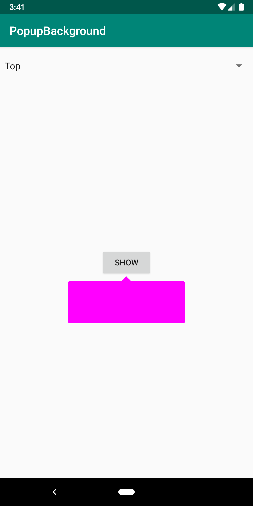
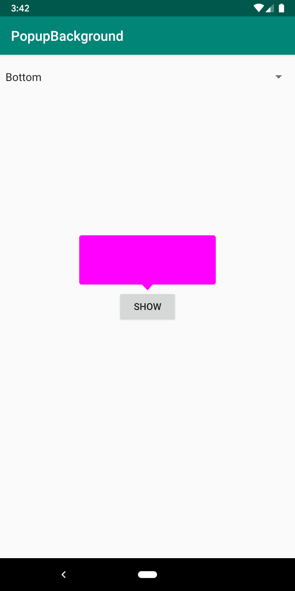
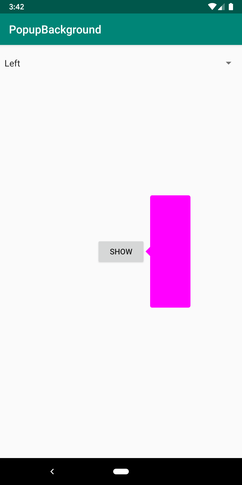
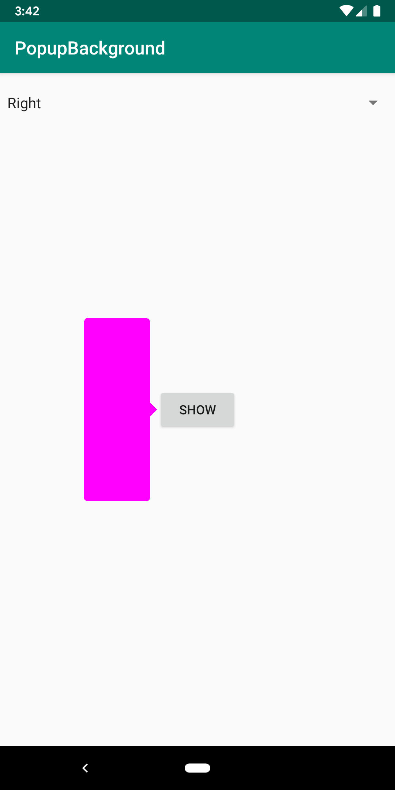

# Popup Background

## Introduction

This is a popup background with the anchor at top, bottom, left or right

## Guideline

PopupBackground can be initialised with the value of color, direction, topLeftRadius, topRightRadius, bottomLefRadius, bottomRightRadius, paddingSide, radius. These values have the default value so you don't need set when using PopupBackground.
Example:

``` kotlin
PopupBackground(color = Color.MAGENTA, direction = AnchorDirection.TOP)
```

The background is 

``` kotlin
PopupBackground(color = Color.MAGENTA, direction = AnchorDirection.BOTTOM)
```

The background is 

``` kotlin
PopupBackground(color = Color.MAGENTA, direction = AnchorDirection.LEFT)
```

The background is 

``` kotlin
PopupBackground(color = Color.MAGENTA, direction = AnchorDirection.RIGHT)
```

The background is 
You can easy to configure with kind of Anchor direction in your code.
